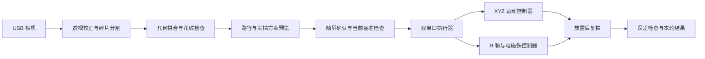

# 视觉拼图与运动控制系统

面向 A4 工作区的实验性拼图装置：使用相机识别碎片，生成拼合方案，通过触摸屏确认，再由双控制器完成移动、旋转、吸取和放置。另提供独立的写字机串口控制与 SVG 转 G-code 工具。

> **项目状态：实验性开源，视觉有时不稳定。** 原开发板已损坏，后续视觉优化和实机复测因此中断。当前代码不能视为稳定完赛版本或经过完整验收的成品。碎片连片、识别抖动、复拍误判与机械放置偏差仍需继续处理。详见 [已知缺陷](docs/KNOWN_ISSUES.md)。

## 功能组成

| 模块 | 实现内容 | 入口 |
| --- | --- | --- |
| 相机与标定 | 相机预览、四角标定、透视校正、阈值调节 | `spi_control/camera_job.py` |
| 普通拼图 | 四片分割、几何拼合、实拍预览、确认执行 | `spi_control/ordinary_camera.py` |
| 三片拼图 | 背景分割、几何搜索、拼缝花纹检查、连续帧稳定检查 | `E题开源/完赛/puzzle_vision_poker/main.py` |
| 路径与执行 | 路径规划、方案绑定、XYZ 移动、R 旋转、吸放、复拍 | `approved_plan.py`、`dual_serial_executor.py` |
| 触屏 | 800×480 页面、手动控制、方案确认、运行与停止状态 | `spi_control/start_page.py` |
| 辅助固件 | 步进脉冲、串口协议、继电器、舵机、通信租约 | `firmware/` |
| 写字机工具 | 只读查询、SVG 转换、G-code 预览与逐行发送 | `plotter/grbl_writer.py` |

完整说明：[功能实现分析](docs/ARCHITECTURE.md) · [部署与配置](docs/SETUP.md) · [写字机二次开发](plotter/README.md) · [发布范围与依赖](docs/DEPENDENCIES.md)。

## 数据与控制流程



## 无硬件快速开始

Python 3.10 或以上，在仓库根目录执行：

```bash
python -m pip install -r requirements.txt
python -m plotter.grbl_writer --help
python -m plotter.grbl_writer svg plotter/example.svg preview.nc --z-up 0 --z-down -1 --feed 600
python -m plotter.grbl_writer send COM3 preview.nc
```

最后一条命令只打印待发送内容，不打开串口。运动必须显式启用；示例坐标和速度不代表你的机构已经标定。

触屏依赖已有的 [SPI 显示与触摸驱动](https://github.com/devotehahaha-prog/orangepi-lt758x-spi-touch)，通过 `SPI_DRIVER_DIR` 指向其目录。驱动仓库独立维护，本仓库不重复收录厂商示例、安装包和品牌素材。

公开配置已清除现场相机标定、有效验收状态和设备专属相机路径。运行实机前必须完成本机标定；详见部署文档。仿真保留源码，但历史场景图片与纹理未收录，不能直接承诺完整仿真可复现。

## 许可

本仓库发布的代码和文档使用 [MIT License](LICENSE)。外部运行库、屏幕驱动、芯片 SDK 和工具链遵循各自许可；本仓库许可不覆盖这些外部依赖。项目名称与展示文案采用中性描述，技术型号和依赖名称仅用于说明兼容性。
