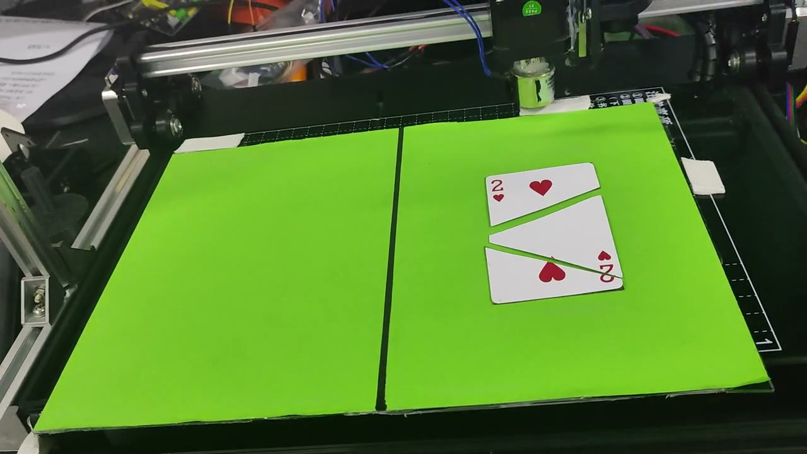
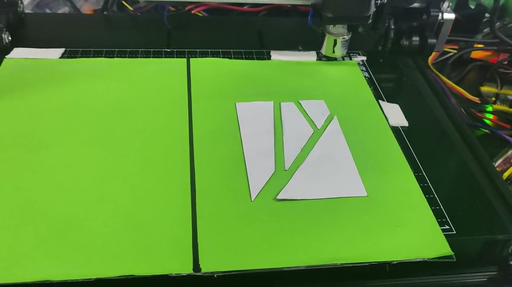
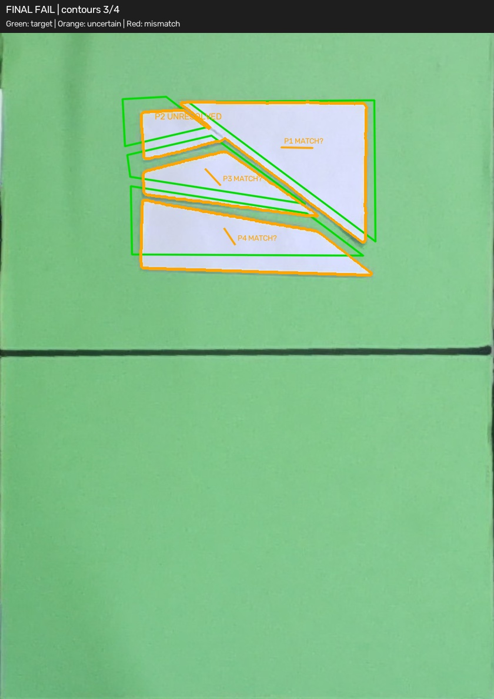
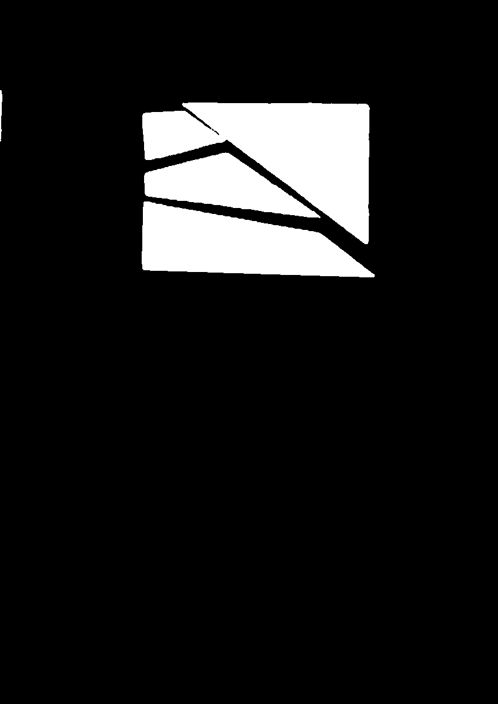

# 现场成功演示与复拍样例

拍摄日期：2026-09-30。两段视频均由项目作者确认为成功运行演示。它们记录的是当时实机运行，不是对当前公开配置的重新验收；公开配置需要在自己的机器上重新标定。

## 三片扑克牌成功演示

[观看或下载完整视频，约 87 秒](https://github.com/devotehahaha-prog/vision-puzzle-machine/releases/download/demo-20260930/poker-success-demo.mp4)

展示三片扑克牌碎片的搬运、旋转和拼合。封面直接取自视频末段，不生成或修饰拼图结果。

## 四片普通拼图成功演示

[观看或下载完整视频，约 77 秒](https://github.com/devotehahaha-prog/vision-puzzle-machine/releases/download/demo-20260930/ordinary-success-demo.mp4)

展示四片白色碎片的搬运与拼合。视频中的成功轮次说明系统实现过完整动作流程，但不能推出所有摆放条件下都能稳定重复。

## 另一轮复拍的缺陷图片

下面两张图来自 `run1955` 现场记录，与上面两段成功演示不是同一轮。图片用于解释识别和复拍的局限，不用于否定成功演示。

叠加图保留原程序输出：绿色是目标，橙色是匹配不确定区域；程序显示 `FINAL FAIL`、`contours 3/4`，表示这一轮四片中只提取到三个主要轮廓。图中的 `UNRESOLVED` / `MATCH?` 不应直接理解为确认漏放。

掩膜可见相邻碎片之间的间隙不足以形成完全独立轮廓，说明分割连片会影响数量与姿态估计。视觉判定误差和实际放置偏差需要分别核对。

## 媒体处理与发布范围

- 两段视频转为 1280×720、30 fps 的 H.264/AAC 发布版，保留原速、完整时长和原声音；未剪掉运行阶段、未重新合成动作。
- 清除了原视频中的定位、手机厂商、型号和拍摄设备元数据。
- 成功演示封面从发布视频末段直接提取；缺陷图片直接使用现有输出文件。
- 视频放在独立媒体预发布页，避免把约 400 MB 原视频写进 Git 历史；该预发布页不是稳定软件版本声明。
- 本地原始视频和图片不变，原始计划 JSON 未上传。

目前仍有偶发视觉不稳定。开发板损坏后，视觉优化与后续实机复测中断，详见 [已知缺陷](KNOWN_ISSUES.md)。
